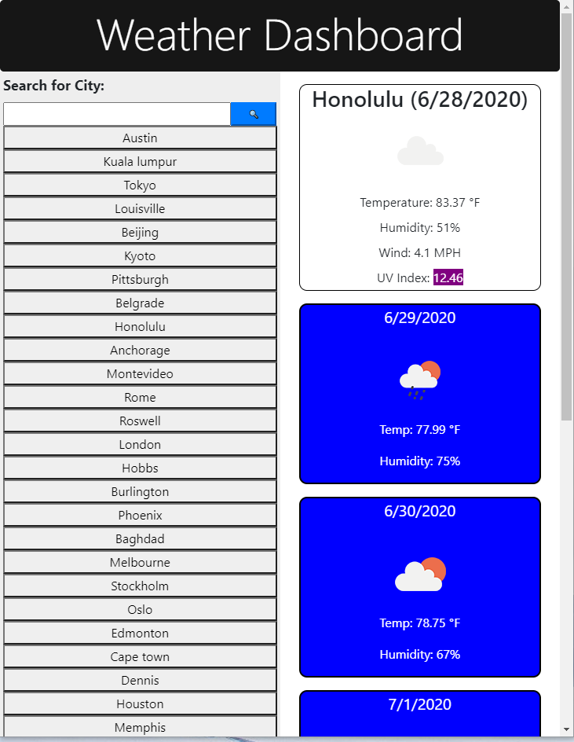

# Weather Dashboard

This program uses a weather API. It imports data from Open Weather Map Organization and populates the data on the screen. Cities around the globe can be searched for, and data will be retreived.

Uses the [OpenWeather API](https://openweathermap.org/api) to retrieve weather data for cities. 

## User Story

Returns present weather conditions in the city as well as a 5 day forecast. Cities will be stored in local storage so user can click on the city again in the future. 

## Code

- Bootstrap grid system was used for layout and responsiveness
- Javascript and JQuery were used for logic 
- AJAX was used for weather server communication
- Code attempts to prevent program from crashing, and creating unneccesary buttons of cities that do not exist

## Preview

